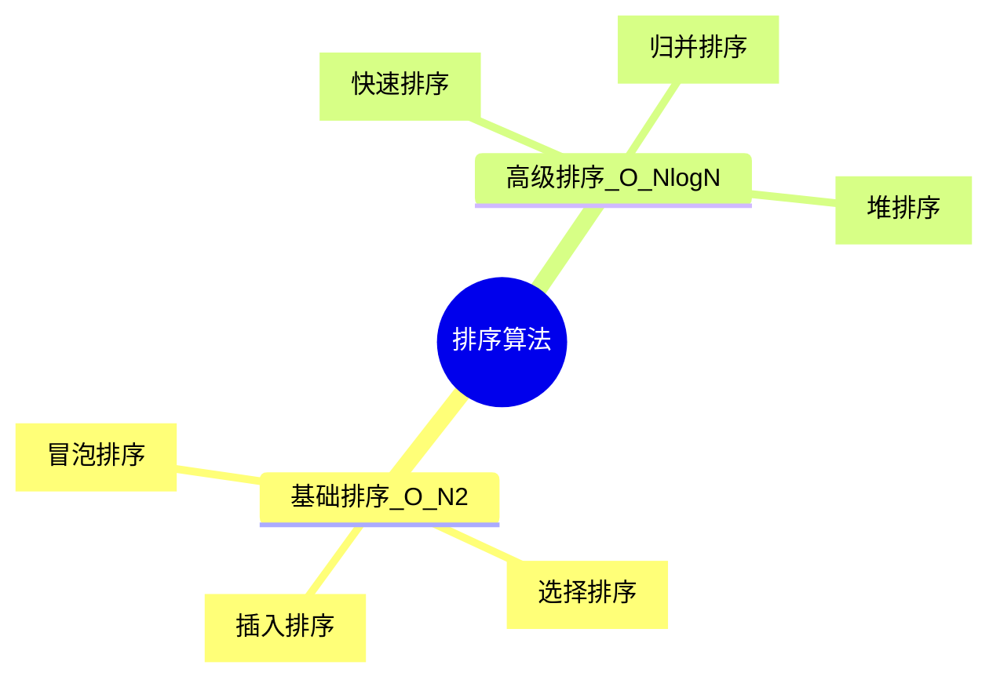

# 🗂️ 排序算法 (Sorting Algorithms)

> 归档: #Algorithm #Sorting 
> 
> 状态: 🌲 知识树根节点
> 
> 最后更新: 2026/01/21

## 🗺️ 知识导航 (Map)

排序算法是计算机科学的基石。我们将常见的排序算法根据**时间复杂度**和**应用场景**分为两大阵营：

代码段

---

## 🐢 基础排序 (Elementary Sorts)

> 适合小规模数据、教学演示或特定几乎有序的场景。

| **笔记链接**            | **核心口诀**    | **最佳场景**              |
| ------------------- | ----------- | --------------------- |
| **[冒泡排序](冒泡排序.md)** | 大鱼吃小鱼，大鱼往后冒 | 教学演示，检测是否已有序          |
| **[选择排序](选择排序.md)** | 狙击手模式，每次抓最小 | 交换成本极高时（交换少）          |
| **[插入排序](插入排序.md)** | 理扑克牌，倒着找坑位  | **数据量小 (<16) 或 基本有序** |

---

## 🚀 高级排序 (Advanced Sorts)

> 分治法与堆结构的结晶，工业级应用的主力。

| **笔记链接**        | **核心思想**                   | **核心优势**          |
| --------------- | -------------------------- | ----------------- |
| [快速排序](快速排序.md) | **分治 (Partition)**：找老大，分左右 | **数组排序之王**，速度最快   |
| [归并排序](归并排序.md) | **分治 (Merge)**：先拆散，再合并     | **链表排序之王**，稳定     |
| [堆排序](堆排序.md)   | **堆结构 (Heap)**：利用完全二叉树     | **Top K 问题**，节省空间 |

---

## 📊 终极速查表 (Cheat Sheet)

在面试前或刷题时，直接参考此表决定使用哪种算法：

| **算法**          | **时间复杂度 (平均)** | **空间复杂度**   | **稳定性** | **备注**                    |
| --------------- | -------------- | ----------- | ------- | ------------------------- |
| [冒泡排序](冒泡排序.md) | $O(N^2)$       | $O(1)$      | ✅       | 效率低，不仅慢还累                 |
| [选择排序](选择排序.md) | $O(N^2)$       | $O(1)$      | ❌       | 无论给什么数据，都是 $O(N^2)$       |
| [插入排序](插入排序.md) | $O(N^2)$       | $O(1)$      | ✅       | **数据越有序，速度越快**            |
| [快速排序](快速排序.md) | $O(N \log N)$  | $O(\log N)$ | ❌       | 最坏情况 $O(N^2)$ (需随机化优化)    |
| [归并排序](归并排序.md) | $O(N \log N)$  | $O(N)$      | ✅       | 需要额外 `temp` 数组空间          |
| [堆排序](堆排序.md)   | $O(N \log N)$  | $O(1)$      | ❌       | 也是 $O(N \log N)$，但常数项比快排大 |

---

## 📝 学习路线建议

1. **入门**: 先看 [冒泡排序](冒泡排序.md) 理解交换，再重点掌握 [插入排序](插入排序.md)（实用）。
    
2. **进阶**: 必须手写 [快速排序](快速排序.md)，理解 Partition 的精髓。
    
3. **精通**: 掌握 [归并排序](归并排序.md)解决链表问题，最后攻克  [堆排序](堆排序.md)解决 Top K。
    

---

> [!TIP]
> 
> 点击上方的 [[ ]] 链接即可跳转到对应的详细笔记。请确保文件名与链接名一致。