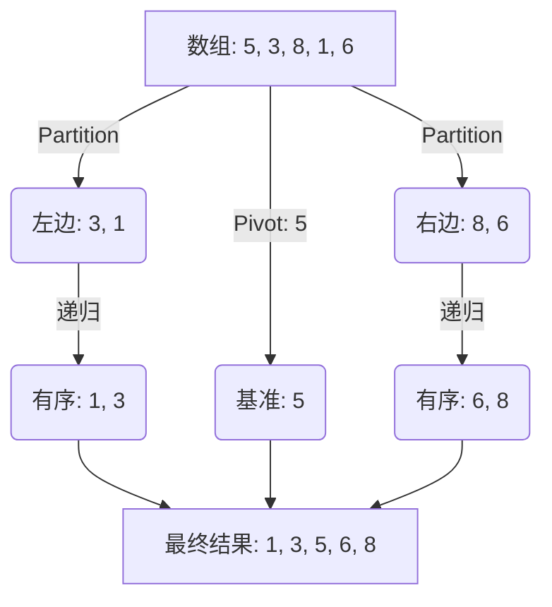
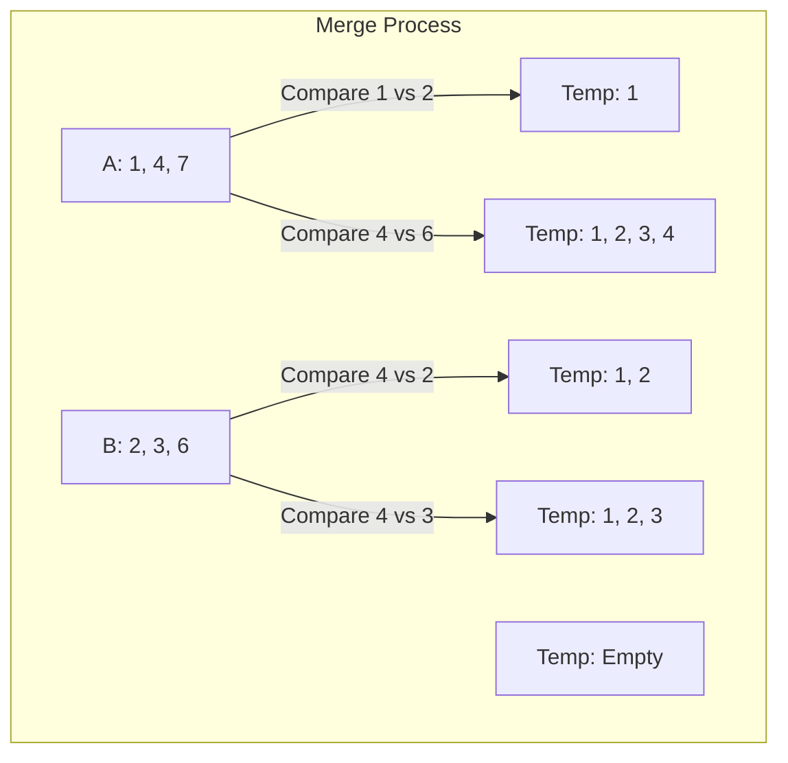

# ⚔️ 排序算法 (Sorting)：分治法的双子星

> 归档日期: 2026/01/21
> 
> 核心主题: 快速排序 (Quick Sort)、快速选择 (Quick Select)、归并排序 (Merge Sort) 原理
> 
> 关键算法: Partition (切分)、Divide & Conquer (分治)、Randomization (随机化)

## 1. 快速排序 (Quick Sort)

快排是工业界最常用的排序算法（如 C++ STL `sort` 的核心）。它的本质是二叉树的 **前序遍历**。

### 1.1 核心思想

1. **选基准 (Pivot)**：随机选一个数做“老大”。
    
2. **切分 (Partition)**：把比老大**小**的甩左边，比老大**大**的甩右边。
    
3. **递归 (Recursion)**：对左右两堆继续重复上述过程。
    

代码段



### 1.2 核心代码：Partition (双指针交换法)

这是快排的心脏。我们要在一个数组里原地“站队”。

> [!WARNING] 易错点
> 
> 1. **循环条件**：必须包含 `i <= j` 防止越界。
>     
> 2. **基准归位**：最后 `swap(nums[left], nums[j])`，并返回 `j`。
>     
> 3. **随机化**：**必须**随机选 Pivot，否则遇到有序数组会退化为 $O(N^2)$ (LeetCode 超时)。
>     


```cpp
int partition(vector<int>& nums, int left, int right) {
    // 🔥 随机化优化：防止有序数组导致 TLE
    int randomIndex = left + rand() % (right - left + 1);
    swap(nums[left], nums[randomIndex]);

    int pivot = nums[left];
    int i = left + 1;
    int j = right;

    while (true) {
        // 找左边的“坏人”（比 Pivot 大的）
        while (i <= j && nums[i] <= pivot) i++;
        
        // 找右边的“坏人”（比 Pivot 小的）
        while (i <= j && nums[j] > pivot) j--;

        if (i >= j) break;

        // 两个坏人互换，变成好人
        swap(nums[i], nums[j]);
    }

    // 老大归位：放到分界点 j
    swap(nums[left], nums[j]);
    return j;
}
```

---

## 2. 快速选择 (Quick Select) - Top K 问题

> 对应题目: [215] 数组中的第K个最大元素
> 
> 时间复杂度: $O(N)$ (几何级数求和：$N + N/2 + N/4... = 2N$)

这是快排的变体。我们不需要排完整个数组，只需要知道 **“第 K 大的数在哪一边”**。

### 2.1 算法逻辑

1. 执行一次 `partition`，得到基准位置 `j`。
    
2. 如果 `j == target`：找到了，直接返回！
    
3. 如果 `j < target`：目标在右边，只递归右半边。
    
4. 如果 `j > target`：目标在左边，只递归左半边。
    

### 2.2 针对 LeetCode 的特殊优化

当数组中有**大量重复元素**（如 10万个 1）时，标准 Partition 会导致树极度不平衡。

> [!TIP] 平衡技巧
> 
> 将判断条件改为 严格不等式 (nums[i] < pivot)，遇到相等的也停下来交换。
> 
> 这样虽然交换次数变多了，但能把重复元素均匀分散到左右两边，保证 $O(N)$ 复杂度。


```cpp
// 针对大量重复元素的修改版 Partition 片段
while (true) {
    while (i <= j && nums[i] < pivot) i++; // 去掉等号
    while (i <= j && nums[j] > pivot) j--; // 保持严格大于
    if (i >= j) break;
    
    swap(nums[i], nums[j]);
    i++; j--; // 交换后手动推一步，防止死循环
}
```

---

## 3. 归并排序 (Merge Sort) 原理

快排的“死对头”。本质是二叉树的 **后序遍历**。

### 3.1 核心逻辑

1. **分 (Divide)**：一刀两断，递归切分直到只剩一个元素。
    
2. **合 (Merge)**：把两个有序数组合并成一个大的有序数组。
    

### 3.2 核心引擎：Merge 函数

双指针法，谁小取谁，放入临时数组 `temp`。

代码段



> [!NOTE] 为什么需要归并？
> 
> - **稳定性 (Stable)**：相等元素的相对位置不会变（快排做不到）。
>     
> - **链表排序 (Linked List)**：链表不能随机访问，快排很难受，归并是唯一神。
>     

---

## 4. 算法对比总结 (Cheat Sheet)

|**特性**|**快速排序 (Quick Sort)**|**归并排序 (Merge Sort)**|
|---|---|---|
|**遍历方式**|前序 (先切分，再递归)|后序 (先递归，再合并)|
|**时间复杂度**|$O(N \log N)$|$O(N \log N)$|
|**空间复杂度**|$O(\log N)$ (栈)|$O(N)$ (Temp 数组)|
|**稳定性**|❌ 不稳定|✅ 稳定|
|**应用场景**|数组通用排序 (C++ std::sort)|链表排序、对象属性排序|

---

## 5. 待办事项 (To-Do)

- **明日任务**:
    
    - [ ] 完整实现 **归并排序** 代码并提交 LeetCode 912。
        
    - [ ] 学习 **二分查找 (Binary Search)** 及其边界细节。
        
    - [ ] (待定) 堆排序原理与 Top K 堆解法。