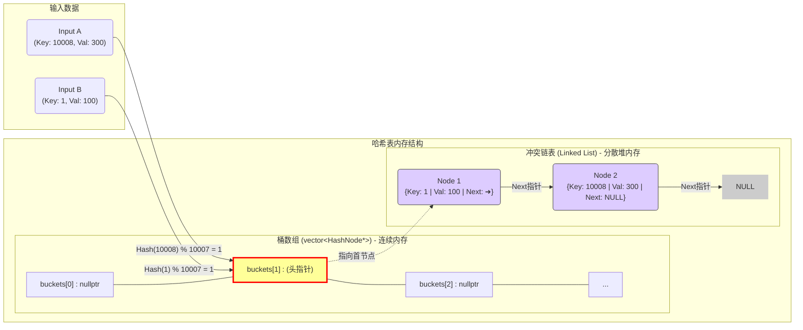

# 📅 Day 5: 哈希表 (Hash Table) 从原理到实战

## 1. 核心原理：哈希表是如何工作的？

哈希表（Hash Table）是一种通过 **哈希函数** 将 Key 映射到数组下标的数据结构，旨在实现 $O(1)$ 的快速查找。

### 🧠 形象理解：“超级酒店”

- **数组 (Buckets)**：酒店的大楼，有固定的房间号（0, 1, 2...）。
    
- **哈希函数 (Hash Function)**：前台规则，比如 `ID % 10 = 房间号`。
    
- **哈希冲突 (Collision)**：两个人的 ID 算出同一个房间号。
    
- **拉链法 (Chaining)**：解决冲突的方法。房间里不住人，而是挂一条“链表”（走廊），冲突的人依次排在走廊里。
    


> [!TIP] 为什么叫 unordered?
> 
> C++ STL 中 unordered_map 底层是哈希表，数据是无序的。
> 
> 而 map 底层是红黑树（Red-Black Tree），数据是有序的（按 Key 从小到大）。
> 
> - **性能对比**：`unordered_map` 查找通常是 $O(1)$，`map` 是 $O(\log N)$。刷题优先用 `unordered_map`。
>     

---

## 2. C++ 底层实现：手写拉链法 (Chaining)

要彻底理解哈希表，必须掌握**指针数组**配合**链表**的实现方式。

### 🏗️ 核心结构设计


```cpp
// 1. 节点结构 (存数据 + 下个指针)
struct HashNode {
    int key;
    int val;
    HashNode* next;
    HashNode(int k, int v) : key(k), val(v), next(nullptr) {}
};

// 2. 哈希表类
class MyHashTable {
    // 桶数组：存的是链表的【头指针】，而不是节点对象
    vector<HashNode*> buckets; 
    // ...
};
```


### ⚡ 关键技术点

#### A. 为什么要用 `vector<HashNode*>` (存指针)?

- **判空简单**：`buckets[i] == nullptr` 即为空桶。
    
- **内存优化**：初始化时不占用节点内存，只有插入数据才 `new`。
    
- **灵活**：方便进行链表操作（如头插法）。
    

#### B. 冲突解决：头插法 (Head Insertion)

当发生冲突时，将新节点直接插在链表最前面，速度为 $O(1)$。


```cpp
HashNode* newNode = new HashNode(key, value);
newNode->next = buckets[index]; // 1. 新节点指向旧头
buckets[index] = newNode;       // 2. 桶指向新节点
```

> [!WARNING] 内存泄漏警示
> 
> 手动 new 出来的节点，vector 销毁时不会自动帮你删除。
> 
> 必须显式编写 析构函数 (~MyHashTable)，遍历所有桶，沿链表逐个 delete 节点。

---

## 3. STL 工具箱：pair 与 list

在不需要手写底层时，我们使用 C++ 标准库。

|**工具**|**用途**|**代码示例**|
|---|---|---|
|**std::pair**|捆绑两个数据 (Key, Value)|`pair<int, int> p(1, 100);`<br><br>  <br><br>`p.first` 是 Key, `p.second` 是 Value|
|**std::list**|双向链表 (解决冲突用)|`list<pair<int,string>> chain;`|

**关于 `vector<list<pair<int,int>>>` 的理解：**

- 这是一个数组，每个格子里装了一个链表管理器。
    
- 链表的第一个节点**就是数据节点**，STL 内部封装了细节，对使用者来说没有 Dummy Node（哨兵）。
    

---

## 4. ⚔️ 算法实战总结

### [242] 有效的字母异位词 (Valid Anagram)

- **核心思路**：统计字符出现的频次。`s` 加频次，`t` 减频次，最后看是否全为 0。
    
- **优化技巧**：因为只有 'a'-'z'，可以用 **数组** 代替 Map，速度快 10 倍。
    
- **代码片段**：
    
    
    ```cpp
    int record[26] = {0};
    record[s[i] - 'a']++;
    ```
    

### [349] 两个数组的交集 (Intersection)

- **核心思路**：去重 + 查找。
    
- **工具**：`unordered_set` (集合)。
    
- **技巧**：
    
    1. `nums1` 放入 Set A。
        
    2. 遍历 `nums2`，如果 Set A 里有，加入结果并从 Set A 中 **删除** (防止重复添加)。
        

### [1] 两数之和 (Two Sum)

- **核心思路**：哈希表记录**历史数据**。
    
- **策略**：边遍历边查。问：“我需要的另一半 (`target - nums[i]`) 在之前出现过吗？”
    
- **结构**：`unordered_map<数值, 下标>`。
    

### [49] 字母异位词分组 (Group Anagrams)

- **核心思路**：找到“共性”作为 Key。
    
- **Key 的构造**：对字符串内部进行排序。`"eat"` -> `"aet"`。
    
- **Value**：`vector<string>` 存原单词。
    
    
    ```cpp
    string key = s;
    sort(key.begin(), key.end()); // key变成 "aet"
    map[key].push_back(s);        // value存 "eat"
    ```
    

### [128] 最长连续序列 (Longest Consecutive Sequence) 🔥

- **难点**：要求 $O(N)$ 复杂度，不能排序。
    
- **核心逻辑**：**只从“车头”开始数**。
    
- 如何判断车头？
    
    如果 num - 1 不在集合中，说明 num 是序列的起点。
    
    
    ```cpp
    unordered_set<int> st(nums.begin(), nums.end());
    for (int num : st) {
        if (!st.count(num - 1)) { // 关键剪枝：只处理车头
            // while循环往后数...
        }
    }
    ```


> [!NOTE] 复杂度分析
> 
> 虽然有两层循环，但每个数字最多被访问两次（一次在 for 中被跳过，一次在 while 中被计数）。所以是严格的 $O(N)$。
---

## 5. 常见误区自检

1. ❌ **误用 Map 类型**：题目只需要判断“存不存在”，却用了 `unordered_map`。
    
    - ✅ **修正**：只查存在用 `unordered_set`，需要存下标/次数才用 `unordered_map`。
        
2. ❌ **迭代器失效**：在 `for` 循环遍历 Map/List 时直接 `erase(it)`。
    
    - ✅ **修正**：使用 `it = list.erase(it)` 接住下一个有效的迭代器。
        
3. ❌ **Key/Value 搞反**：在统计频率时，把 `count` 当作 Key。
    
    - ✅ **修正**：`map<字符, 次数>`。Key 必须是唯一的那个属性。
        

---

> 
> Date: 2026-01-14
> 
> Tags: #Cpp #Algorithm #HashTable #LeetCode