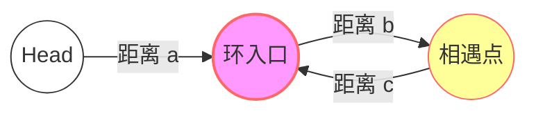
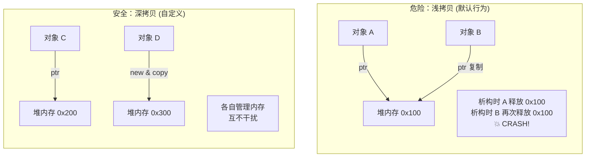

# 📅 Day 6: 复盘与内功 (Review & Internals)

## 1. 算法中的数学：环形链表证明

在 [142] 环形链表 II 中，代码只是最终结果，核心在于数学证明。

### 🧠 快慢指针的路程推导

设：

- **$a$**：起点到环入口的距离。
    
- **$b$**：环入口到相遇点的距离。
    
- **$c$**：相遇点回到环入口的距离。
    
- **$L$**：环周长 ($b+c$)。
    

代码段



**推导过程：**

1. 路程公式：Fast 走的距离是 Slow 的 2 倍。
    
    $$2(a + b) = a + b + n(b + c)$$
    
2. 化简：
    
    $$a + b = n(b + c)$$
    
    $$a = (n - 1)(b + c) + c$$
    
3. 物理意义：
    
    当 $n=1$ 时，$a = c$。
    
    这意味着：一个指针从 Head 出发，另一个从相遇点 Meet 出发，以相同速度行走，必在环入口相遇。
    

---

## 2. C++ 底层内功：指针与内存管理

今天不仅手写了哈希表，还补习了《C++ Primer》中关于对象生命周期的核心知识。

### ⚖️ 指针与 Const (The "Left/Right" Rule)

口诀：**看 `const` 在 `*` 号的左边还是右边。**

|**声明**|**含义**|**助记**|**代码示例**|
|---|---|---|---|
|`const int * p`|**底层 const**|左定值 (Value固定)|`*p = 10;` (❌ 报错)<br><br>  <br><br>`p = &b;` (✅ 允许)|
|`int * const p`|**顶层 const**|右定向 (Pointer固定)|`*p = 10;` (✅ 允许)<br><br>  <br><br>`p = &b;` (❌ 报错)|

### 🧬 深拷贝 vs 浅拷贝 (Deep vs Shallow Copy)

这是 C++ 面试中的“核弹级”考点，也是导致 **Double Free** 错误的元凶。

代码段



> [!WARNING] Rule of Three (三法则)
> 
> 如果你显式定义了 析构函数 (用于 delete 内存)，那你几乎肯定也需要显式定义 拷贝构造函数 和 拷贝赋值运算符。

---

## 3. 手写数据结构：工程级哈希表

今天的重头戏是修复手写哈希表中的内存泄漏 Bug。

### 🛠️ 关键代码复盘

#### A. 析构函数的正确写法

错误：只删除了 buckets[0] 或者只删除了头节点。

正确：遍历所有桶，遍历每个桶的链表。


```cpp
~MyHashTable() {
    for (int i = 0; i < hash_key; i++) {
        ListNode *cur = buckets[i];
        while (cur) {
            ListNode *temp = cur; // 1. 先抓住要删的人
            cur = cur->next;      // 2. 指针先逃跑
            delete temp;          // 3. 安全删除
        }
        buckets[i] = nullptr;     // 4. 避免野指针
    }
}
```

#### B. 删除节点的“断头”处理

在单链表中删除节点，必须区分 **头节点** 和 **中间节点**。


```cpp
if (prev == nullptr) { 
    // 情况1：删除的是头节点 (buckets[index]直接变)
    buckets[index] = chain->next; 
} else {
    // 情况2：删除的是中间节点 (prev绕过cur)
    prev->next = chain->next;
}
delete chain;
```

---

## 4. ⚔️ 算法实战总结

### [151] 反转字符串中的单词 (Reverse Words)

- **策略**：**整体反转 + 局部反转 + 双指针去空格**。
    
- **去空格模板** (In-place O(1) space)：
    

    
    ```cpp
    // 核心逻辑：只有非空格才处理，且除了首单词外，主动补一个空格
    if (s[fast] != ' ') {
        if (slow != 0) s[slow++] = ' '; // 单词间补空格
        while (fast < n && s[fast] != ' ') {
            s[slow++] = s[fast++];      // 移动单词
        }
    }
    ```
    

### [15] 三数之和 (3Sum)

- **核心**：排序 + 双指针 + **去重**。
    
- **去重逻辑**：
    
    1. **外层去重**：`if (i > 0 && nums[i] == nums[i-1]) continue;`
        
    2. **内层去重**：找到答案后，`while (L < R && nums[L] == nums[L+1]) L++;`
        

---

## 5. C++ 最佳实践自检 (Effective C++)

1. **构造函数初始化列表**：
    
    - ✅ `Student(string n) : name(n) {}` (效率高，直接初始化)
        
    - ❌ `Student(string n) { name = n; }` (效率低，先构造再赋值)
        
    - **强制场景**：`const` 成员、引用成员、无默认构造的类成员。
        
2. **Static 成员**：
    
    - 属于类，不属于对象。
        
    - 在 `.h` 声明，必须在 `.cpp` 定义（分配内存），否则链接报错。
        

---

> Date: 2026-01-15
> 
> Tags: #Cpp #MemoryManagement #LinkedList #Review