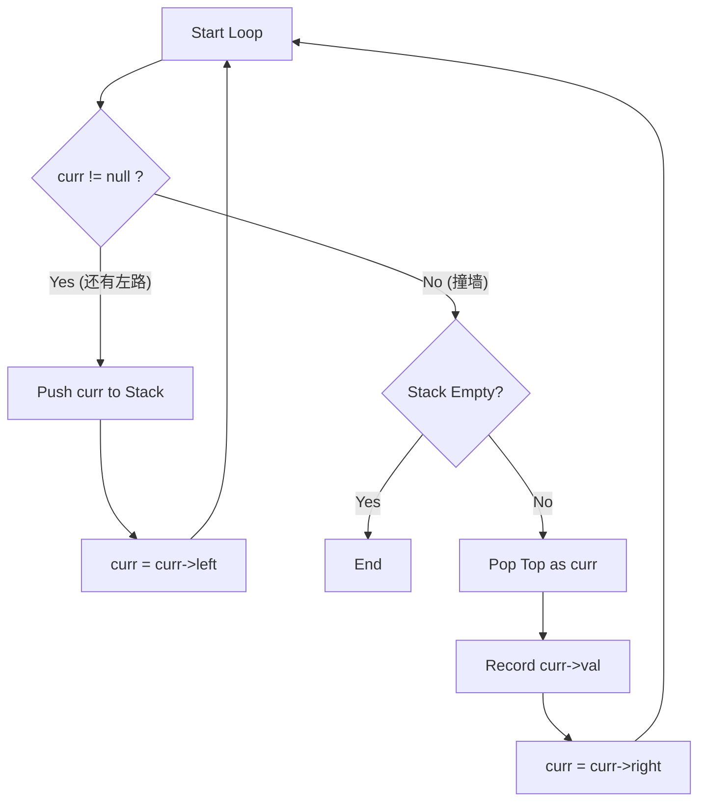
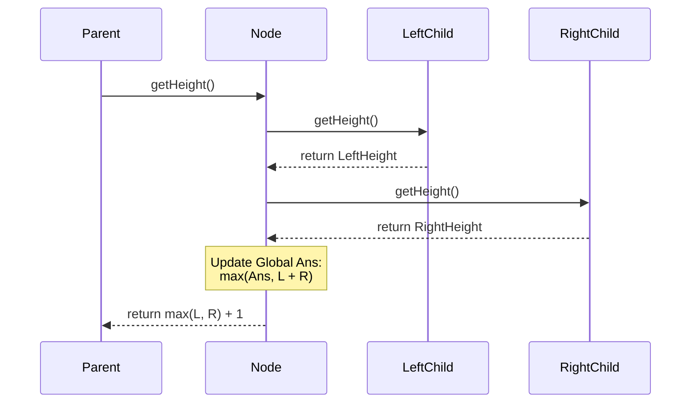
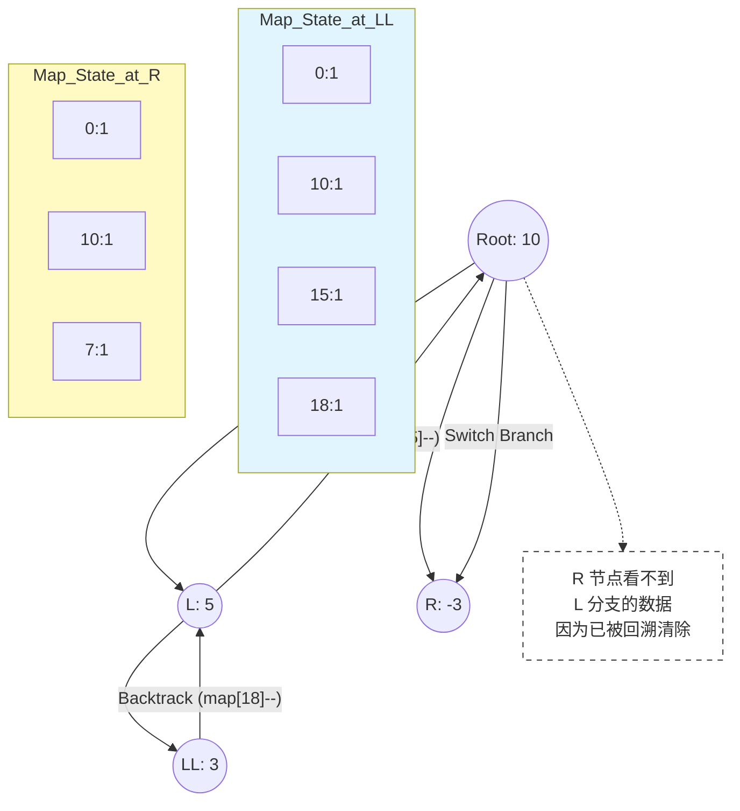

# 🌳 二叉树 (Binary Tree)：从递归到算法融合

> 归档日期: 2026/01/20
> 
> 涵盖周期: Day 9 - Day 10
> 
> 核心主题: 递归思维、系统栈与堆迭代、自底向上模式、前缀和回溯

## 1. 核心思维转换 (Mental Model)

二叉树是数据结构的分水岭，核心在于思维从“线性”向“分叉”的跨越，以及对内存栈帧（Stack Frame）的深刻理解。

### 1.1 递归的本质：钻井与铺路

递归不是魔法，而是 **Pointer Chasing（指针追逐）** 与 **System Stack（系统栈）** 的结合。

- **钻井 (Drill Down)**：函数调用自身，压栈。对应 **前序遍历 (Pre-order)** 的逻辑（先办事，再深入）。
    
- **铺路 (Pave Up)**：函数 `return`，弹栈。对应 **后序遍历 (Post-order)** 的逻辑（先深入，回来时办事）。
    

::: danger 🚨 内存警示：栈溢出 (Stack Overflow)

通过 infiniteRecursion 实验测得，本机（及大多数标准 OS 环境）的 Stack Limit 约为 8MB。

- 在不做尾递归优化的情况下，最大递归深度约为 **74,000 层**。
    
- 启示：生产环境或处理退化为链表的树时，慎用递归，优先考虑迭代法或增大栈空间。
    
    :::
    

### 1.2 树的物理存储

```cpp
struct TreeNode {
    int val;
    TreeNode *left;
    TreeNode *right;
    TreeNode(int x) : val(x), left(nullptr), right(nullptr) {}
};
// 内存模型：Heap 中分散的节点通过 Pointer 相互连接
```

---

## 2. 遍历体系 (Traversals)

### 2.1 DFS：递归全家桶

利用系统栈隐式维护路径。

- **前序 (Pre)**: `根 -> 左 -> 右` (DFS 序)
    
- **中序 (In)**: `左 -> 根 -> 右` (BST 排序)
    
- **后序 (Post)**: `左 -> 右 -> 根` (删除节点、算高度)
    

### 2.2 BFS：层序遍历

利用 **Queue (FIFO)** 进行横向扫描。

**核心模版 (分层处理)**：


```cpp
while (!q.empty()) {
    int size = q.size(); // 🔒 锁定当前层节点数
    for (int i = 0; i < size; i++) { // 只处理这一层的
        TreeNode* node = q.front(); q.pop();
        if (node->left) q.push(node->left);
        if (node->right) q.push(node->right);
    }
}
```

>[!TIP] 
>
>工业级接口写法 避免在递归函数中直接返回 `vector`（会导致大量内存拷贝）。应采用 **Helper Function** 模式：`void traversal(node, vector<int>& res)` 通过引用传递结果集。

### 2.3 迭代法 (Iterative DFS)

利用 `std::stack` 在堆内存中模拟递归，避免栈溢出。**中序迭代** 是难点。

**逻辑状态机**：

1. **Drill Left**: 只要有路，拼命往左钻，沿途入栈。
    
2. **Backtrack**: 没路了，弹出栈顶（访问），转向右子树。
    

代码段



**关键代码 (中序)**：


```cpp
while(root != nullptr || !st.empty()) {
    if(root != nullptr) {
        st.push(root);      // 存包
        root = root->left;  // 钻井
    } else {
        root = st.top();    // 取包
        st.pop();
        res.push_back(root->val); // 办事
        root = root->right; // 转向
    }
}
```

---

## 3. 自底向上模式 (Bottom-Up Pattern)

解决树高、平衡、直径等问题的通用解法。核心在于 **后序遍历**：先拿到子树的信息，整合后再汇报给父节点。

### 3.1 模式解析

- **输入**：子树的返回值（高度、是否平衡等）。
    
- **处理**：当前节点的逻辑（计算直径、判断差值）。
    
- **输出**：向父节点汇报自身属性（通常是 `max(L, R) + 1`）。
    

### 3.2 经典案例：二叉树直径 ([543])

利用 **全局变量** 记录过程中的最大值，利用 **返回值** 维护递归逻辑。




> [!NOTE] 优化技巧 ([110] 平衡二叉树)
> 
> 如果发现子树已经不平衡，直接返回特定错误码（如 -1），实现 剪枝，将复杂度从 $O(N^2)$ 降为 $O(N)$。

---

## 4. 算法融合：前缀和与回溯

题目：[437] 路径总和 III (Path Sum III)

难点：寻找任意向下的路径和等于 target。

技术栈：DFS + Hash Map (Prefix Sum) + Backtracking。

### 4.1 数学原理

$$\text{Target Path} = \text{CurrPrefix} - \text{OldPrefix}$$

$$\therefore \text{Find OldPrefix} = \text{CurrPrefix} - \text{Target}$$

### 4.2 回溯的核心：时空隔离

Map 中永远只保存 **当前节点到根节点** 这一条路径上的前缀和。

- **进入节点**：`map[currSum]++` (注册)
    
- **离开节点**：`map[currSum]--` (注销)
    




### 4.3 代码易错点


```cpp
// ❌ 错误写法
if (prefixMap.count(target - currSum)) 

// ✅ 正确写法：历史 = 当前 - 目标
if (prefixMap.count(currSum - target)) 
```

---

## 5. 待办与复习 (To-Do)

- **待办**: [215] 数组第 K 大元素的 **Quick Select** 解法（Day 11/12 安排）。
    
- **待办**: 《Effective C++》条款 11-12 (operator= 实现细节)。
    
- **复习**: 每天手写一次 DFS 递归模版与中序迭代模版，保持肌肉记忆。
